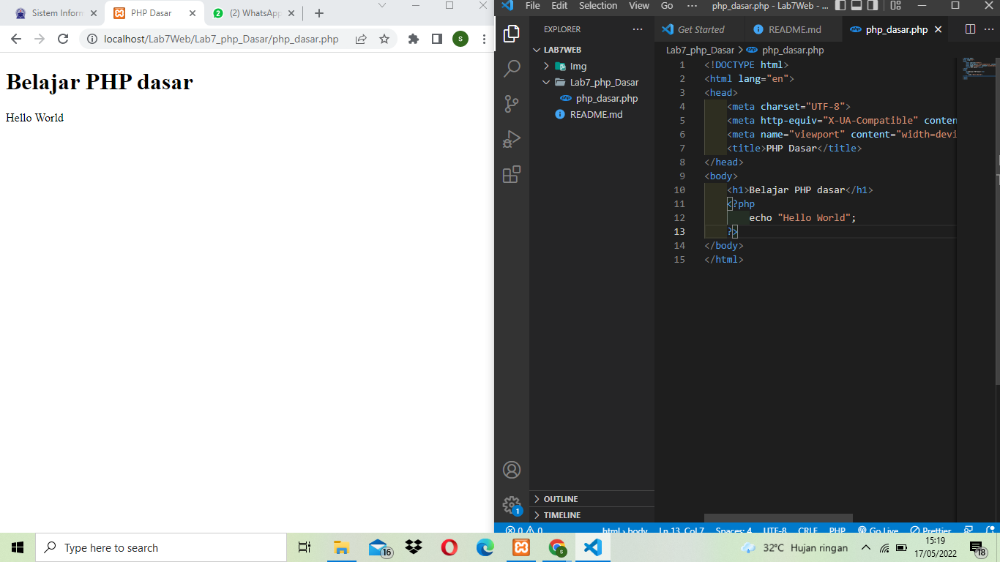
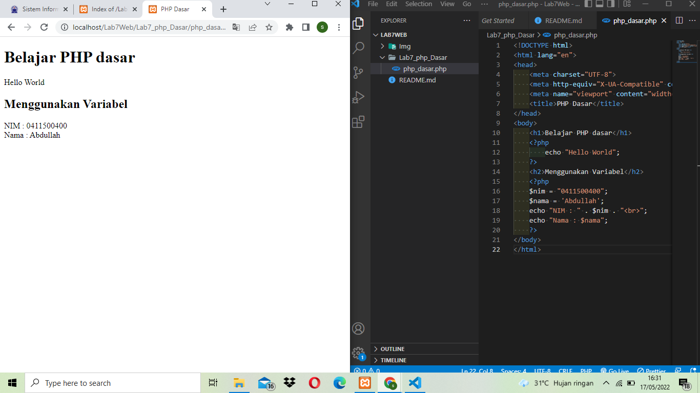
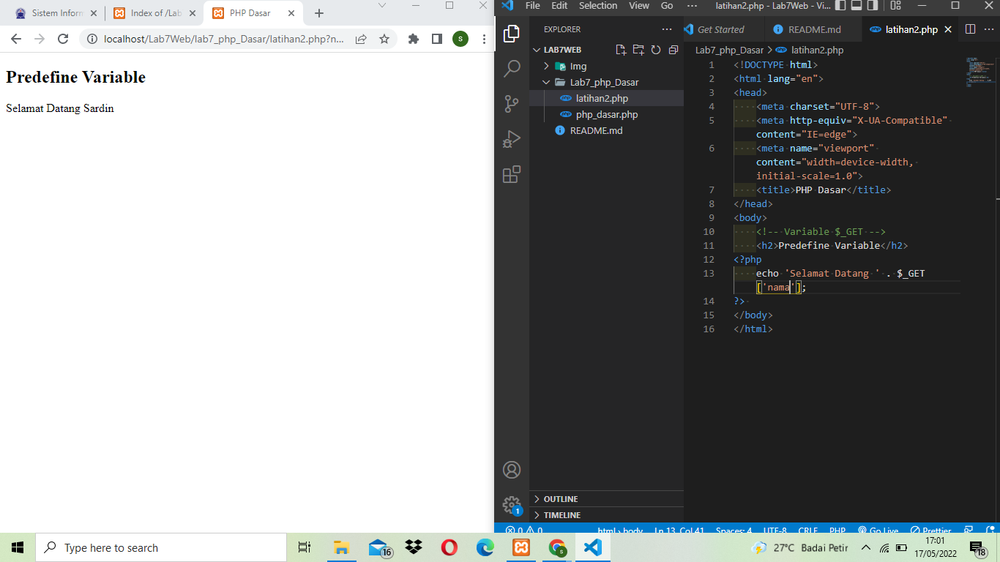
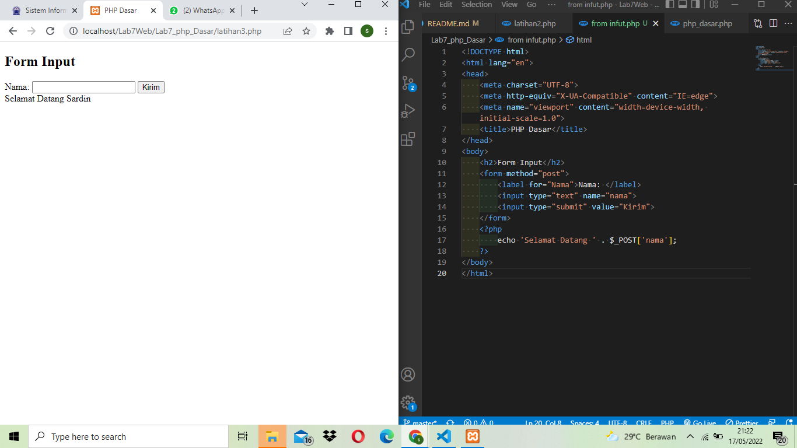
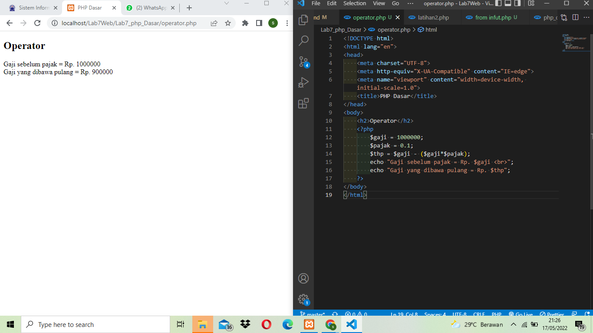
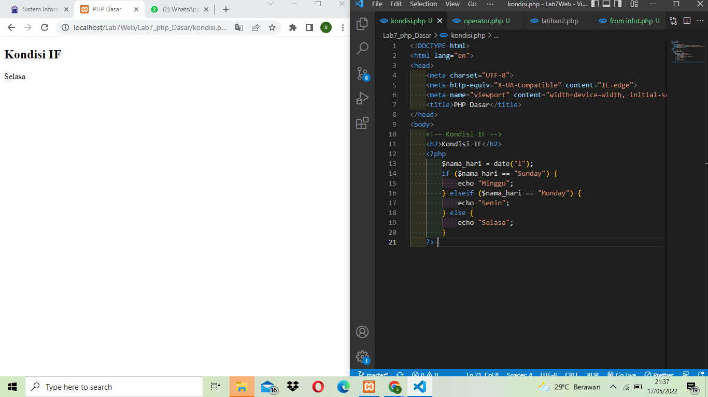
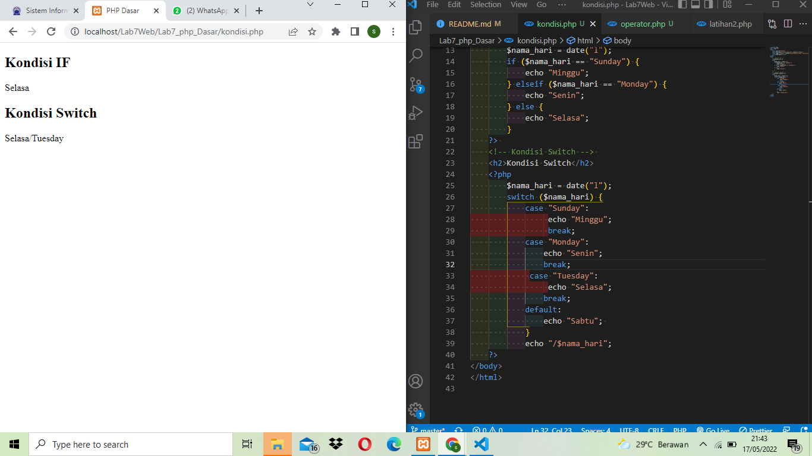
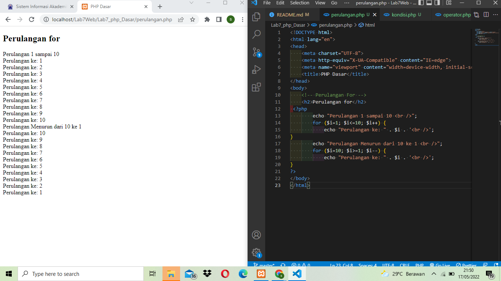
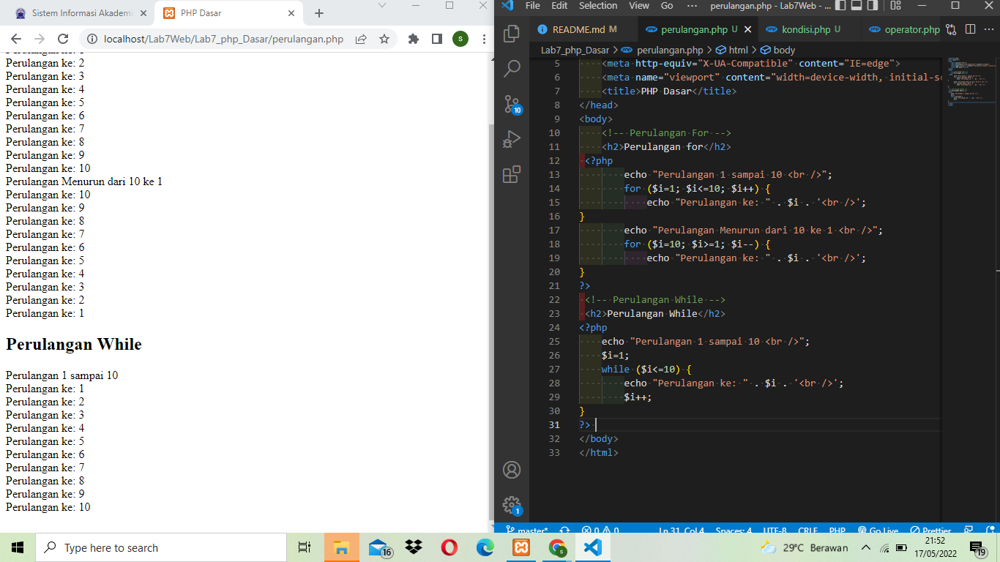

| Nama   | Sardin         |
| ------ | -------------- |
| NIM    | 312010135      |
| Kelas  | TI.20.A1       |
| Matkul | Pemograman Web |

# PERTEMUAN 9

## LAB 7 WEB

Di pertemuan kali ini kita akan mempelajari **PHP DASAR** dengan beberapa program code **_PHP_** nya.

## Belajar PHP Dasar

## LANGKAH - LANGKAH PRAKTIKUM

### 1. Instal XAMPP Untuk Server


**PENJELASAN**<br>
Install XAMPP untuk **_WEB SERVER_** dan kemudian ekstrak file nya dan sesuaikan dimana kalian menyimpan file tersebut.

### 2. Menjalankan Web Server


**PENJELASAN**<br>
Mengaktifkan **XAMPP** dengan menekan tombol **START SERVER APACHE** Seperti gambar di atas.

### 3. Memulai Php

Buat folder Lab7\*php_Dasar pada root directory web server (c:Xampp/htdocs/Lab7Web)

**PENJELASAN**<br>
Di atas saya membuat folder **lab7_php_Dasar** yang dimana folder itu disimpan dalam folder **Lab7Web** untuk repository

Kemudian akses directory pada web server dengan mengakses URL:http://localhost/Lab7Web/Lab7_php_Dasar/

**PENJELASAN**

Di atas adalah contoh dari tampil dalam URI atau tampilan server folder tersebut.

### 4. PHP Dasar

Buat File baru dengan nama **php_dasar.php** pada directory tersebut kemudian buat kode seperti berikut.

**PENJELASAN**<br>
Kemudian akses URL untuk hasil nya :http://localhost/Lab7Web/Lab7_php_Dasar/php_dasar.php

Di atas adalah contoh hasil dari penggunaan **PHP** dalam file html atau **embed**

```code php
<!DOCTYPE html>
<html lang="en">
<head>
    <meta charset="UTF-8">
    <meta http-equiv="X-UA-Compatible" content="IE=edge">
    <meta name="viewport" content="width=device-width, initial-scale=1.0">
    <title>PHP Dasar</title>
</head>
<body>
    <h1>Belajar PHP Dasar</h1>
    <?php
        echo "Hello World";
    ?>
</body>
</html>
```

### 5. VARIABEL PHP

Menambahkan Variabel pada program

**PENJELASAN**<br>
Di atas adalah contoh penggunaan Variabel di **PHP**

```code php
<h2>Menggunakan Variabel</h2>
    <?php
    $nim = "0411500400";
    $nama = 'Abdullah';
    echo "NIM : " . $nim . "<br>";
    echo "Nama : $nama";
    ?>
```

### 6. PREDEFINE VARIABLE $\_GET

Menggunakan **Predefine Variable**

**PENJELASAN**<br>
Buat File baru dalam directory **lab7_php_dasar** dengan nama file nya adalah **latihan2.php** dan buat code seperti dibawah dan untuk mengaksesnya gunakan URL: http://localhost/Lab7Web/lab7_php_Dasar/latihan2.php?nama=Sardin dan tampilan nya seperti gambar diatas.

```code php
<!DOCTYPE html>
<html lang="en">
<head>
    <meta charset="UTF-8">
    <meta http-equiv="X-UA-Compatible" content="IE=edge">
    <meta name="viewport" content="width=device-width, initial-scale=1.0">
    <title>PHP Dasar</title>
</head>
<body>
    <!-- Variable $_GET -->
    <h2>Predefine Variable</h2>
<?php
    echo 'Selamat Datang ' . $_GET['nama'];
?>
</body>
</html>
```

### 7. MEMBUAT FORM INPUT


**PENJELASAN**<br>
Buat File baru dengan nama **_from infut.php_** dalam directory folder **lab7_php_dasar** di atas adalah hasil atau tampilan dalam membuat form dalam php dengan variable $\_POST contoh code seperti dibawah

```code php
<!-- Form Infut -->
<!DOCTYPE html>
<html lang="en">
<head>
   <meta charset="UTF-8">
   <meta http-equiv="X-UA-Compatible" content="IE=edge">
   <meta name="viewport" content="width=device-width, initial-scale=1.0">
   <title>PHP Dasar</title>
</head>
<body>
   <h2>Form Input</h2>
   <form method="post">
       <label for="Nama">Nama: </label>
       <input type="text" name="nama">
       <input type="submit" value="Kirim">
   </form>
   <?php
       echo 'Selamat Datang ' . $_POST['nama'];
   ?>
</body>
</html>
```

### 8. OPERATOR


**PENJELASAN**<br>
Membuat **_OPERATOR_** dalam php seperti contoh hasil tampilan di atas beserta code nya.

```code php
<!DOCTYPE html>
<html lang="en">
<head>
    <meta charset="UTF-8">
    <meta http-equiv="X-UA-Compatible" content="IE=edge">
    <meta name="viewport" content="width=device-width, initial-scale=1.0">
    <title>PHP Dasar</title>
</head>
<body>
    <h2>Operator</h2>
    <?php
        $gaji = 1000000;
        $pajak = 0.1;
        $thp = $gaji - ($gaji*$pajak);
        echo "Gaji sebelum pajak = Rp. $gaji <br>";
        echo "Gaji yang dibawa pulang = Rp. $thp";
    ?>
</body>
</html>
```

### 9. KONDISI IF


**PENJELASAN**<br>
Pengondisian **IF ELSE** seperti hasil tampilan dan code digambar atas

```code php
<?php
        $nama_hari = date("l");
        if ($nama_hari == "Sunday") {
            echo "Minggu";
        } elseif ($nama_hari == "Monday") {
            echo "Senin";
        } else {
            echo "Selasa";
        }
    ?>
```

### 10. KONDISI SWITCH


**PENJELASAN**<br>
Contoh penggunaan pengondisian **SWICTH CASE** dengan **_Break_** seperti contoh hasil diatas beserta code.

```code php
<?php
        $nama_hari = date("l");
        switch ($nama_hari) {
            case "Sunday":
                 echo "Minggu";
                 break;
            case "Monday":
                echo "Senin";
                break;
             case "Tuesday":
                 echo "Selasa";
                break;
            default:
                echo "Sabtu";
            }
            echo "/$nama_hari";
    ?>
```

### 11. PERULANGAN FOR


**PENJELASAN**<br>
Menggunakan **PERULANGAN FOR** seperti hasil dan code di atas

```code php
<?php
        echo "Perulangan 1 sampai 10 <br />";
        for ($i=1; $i<=10; $i++) {
            echo "Perulangan ke: " . $i . '<br />';
}
        echo "Perulangan Menurun dari 10 ke 1 <br />";
        for ($i=10; $i>=1; $i--) {
            echo "Perulangan ke: " . $i . '<br />';
}
?>
```

### 12. PERULANGAN WHILE


**PENJELASAN**<br>
Menggunakan **PERULANGAN WHILE** seperti hasil gambar dan code di atas.

```code php
<?php
    echo "Perulangan 1 sampai 10 <br />";
    $i=1;
    while ($i<=10) {
        echo "Perulangan ke: " . $i . '<br />';
        $i++;
}
?>
```

### 13. PERULANGAN DOWHILE


**PENJELASAN**<br>
Menggunakan **PERULANGAN DOWHILE** seperti hasil gambar di atas yg beserta code php nya.

```code php
<?php
    echo "Perulangan 1 sampai 10 <br />";
    $i=1;
    do {
        echo "Perulangan ke: " . $i . '<br />';
        $i++;
    } while ($i<=10);
?>
```

## PERTANYAAN DAN TUGAS

Buatlah program **PHP** sederhana dengan menggunakan **_form input_** yang menampilkan nama , tanggal lahir dan **pekerjaan** . Kemudian tampilkan outputnya dengan menghitung umur berdasarkan inputan tanggal lahir . Dan pilihan **pekerjaan** dengan gaji yang berbeda-beda sesuai pilihan **pekerjaan**.


**PENJELASAN**<br>
Contoh dari form input menggunakan **PHP** disitu untuk format **tanggal lahir** format date nya adalah **Tahun/Bulan/Tanggal** dan kemudian menggunakan pengondisian **if/else** untuk menentukan atau memanggil **pekerjaan dan gaji** Seperti contoh di atas jika sudah isi data kemudian tekan tombol submit dan kirim,untuk melihat hasil nya.

```code php
<!DOCTYPE html>
<html lang="en">
<head>
    <meta charset="UTF-8">
    <meta http-equiv="X-UA-Compatible" content="IE=edge">
    <meta name="viewport" content="width=device-width, initial-scale=1.0">
    <title>Tugas</title>
</head>
<body>
   <h2>TUGAS</h2>
    <form class="form" method="post" >
            <label>Nama: </label>
            <br>
            <input type="text" name="nama">
            <br>
            <label>Tanggal Lahir: </label>
            <br>
            <input type="text" name="tgl_lahir">
            <br>
            <label>Pekerjaan: </label>
            <br>
            <select name='pekerjaan'>
                <option value="-">>---Pilih Pekerjaan---<</option>
                <option value='Fullstack Developer'>Fullstack Developer</option>
                <option value='Front end Developer'>Front end Developer</option>
                <option value='Back end Developer'>Back end Develope</option>
                <option value='UI/UX'>UI/UX</option>
                <option value="Project Manager">Project Manager</option>
            </select>
            <br>
            <br>
            <button type="submit">Kirim</button>
    </form>
    <h2>HASIL</h2>

    <?php
        # Memanggil Nama
        echo 'Nama: ' . $_POST['nama'];

        # Merubah Tanggal Lahir menjadi Umur (Tahun)
        $tgl_lahir = @$_POST['tgl_lahir'];

        $lahir = new DateTime($tgl_lahir);
        $hari_ini = new DateTime();

        $diff = $hari_ini->diff($lahir);

        # Memanggil fungsi umur yg sudah dibuat diatas
        echo "<br> Umur: ". $diff->y ." Tahun";

        # Memanggil pekerjaan
        echo "<br> Pekerjaan: ". $_POST['pekerjaan'];

        # Kondisi if pekerjaan untuk menentukan gaji
        $pekerjaan = @$_POST['pekerjaan'];

        if($pekerjaan == "Fullstack Developer"){
            echo '<br> Gaji: Rp. 30.000.000,-';
        }elseif($pekerjaan == "Front end Developer"){
            echo '<br> Gaji: Rp. 12.000.000,-';
        }elseif($pekerjaan == "Back end Developer"){
            echo '<br> Gaji: Rp. 15.000.000,-';
        }elseif($pekerjaan == "UI/UX"){
            echo '<br> Gaji: Rp. 55.000.000,-';
        }elseif ($pekerjaan == "Project Manager"){
            echo '<br> Gaji: Rp. 60.000.000,-';
        }

    ?>
  </body>
</html>
```
